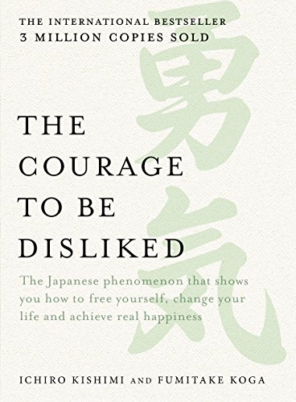

The core philosophy of this book is Life has two objectives. To be **self reliant**, and **live in harmony with society** .i.e Tasks of work, love and friendship. 

Adler claims that all problems are interpersonal problems arising from tasks of work, love or friendship.

For example, if you made a mistake at your work, the problem is not that you made a mistake, we all make mistakes. The problem is the rebuking from your boss.

The solution is to seperate tasks. **Dont intervene in other peoples task nor let others intervene in yours**. Do your task, to recognize it or not is the other persons task. Expecting recognition is self centered behaviour and living others life. 

If you feel inferior, use it as a trigger to better your work. No one is perfect, as long as you **make progress towards your ideal self**, it is good enough. 

Dont compete with others, place confidence in them and look at them as comrades, and contribute to them. Enjoy their success. If you compete with people, subconsciously you will consider them enemies. And fail in your tasks of friendship. The goal is to have a sense of belonging with the largest community of comrades.

When you contribute, and other thank you, you feel a good self worth (self reliant). You accept your self, and this gives you the courage to place in confidence in other and they become your comrades (harmony with society). 

---

This is the ideal case of adler, here are some interesting observations from the book

1. People behave in accordance with their future goals, not past events.
2. Life is meaningless and it is a series of moments. It doesnt need a lofty goal. The journey (series of moments) is what matters. As any moment it can stop, and it should still be a full life. Hence shine a bright light on the now and **live it like a dance**. Dont postpone it. The only way to understand the meaning of life is to live each moment earnestly
3. If you believe in free will, and you believe that people can change. If you believe that your life is not completely determined by your past, and you have control over your future. Then clearly you believe in teleology. If you end up staying in etiology you will be bound by the past and never be able to find happiness. Look at the possibilities of the future. **Possibilities > Past**.
4. Thank dont praise. Praise is being given from the person with ability to the one without. It is vertical relationship. You can have a good relationship only if you have equal relationships.

[Highlights from each chapter](https://roamresearch.com/#/app/codeanand/page/lyopEOFzZ)