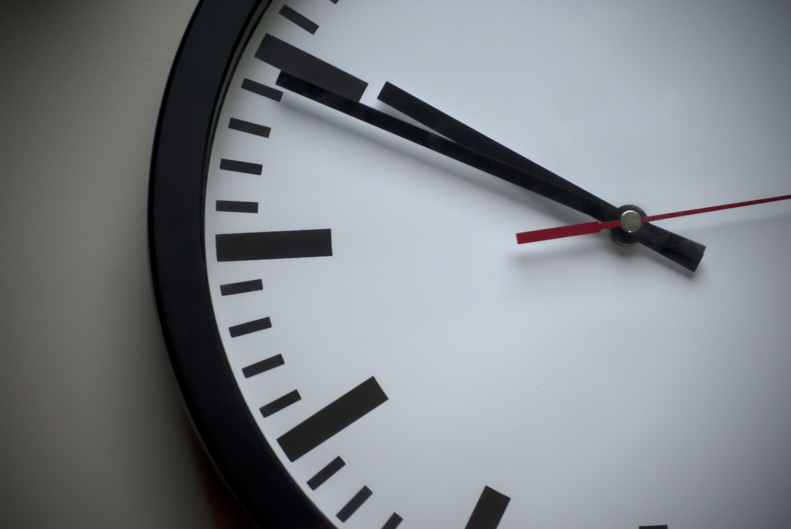

Why do we spend 3 hours to watch a movie? Do we want to ‘just’ kill that time? or does the movie make our life better? Does it add value to our life?

We tell ourselves that life is short and not to waste time, don’t we? Do we have so much freetime, that we are unable to control/entertain our minds in that freetime. We end up leaving it to the StoryTellers to control our minds and kill time. (literally, to be entertained, is to be held)

Does the movie industry exist, because we have free time, and nothing to do that adds value to our lives?

Why default to movies/tv series. Why not choose to spend that time with loved ones/ doing any activity that adds value?

Do we have more time than we need?