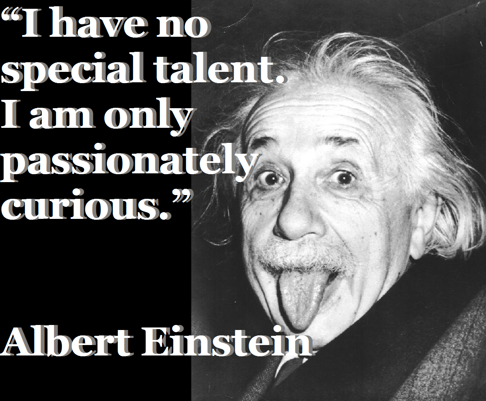

When we are contemplating an important decision, we often find ourselves thinking about what other people will think about this decision.

> "How would my father feel about me quitting my high paying job?".

> "What would my mentor think if I close that old business division to focus on this new one?".

Such questions deep down seek approval. We want to do what our father or mentor approves of.

###  Certainty

Let us diagnose why we seek approval. We seek approval when we are about to lose something. When we have nothing to lose, we don't bother much. We just jump. But when we have something to lose like a well paying job, we become really careful about the decision. We start asking people for advice. *We want to be certain that we are not screwing things up* . We want to be certain that we will be fine, and we are doing the right thing. We fear the unknown or the path less travelled. We fear the pain that might lie ahead.

When we are about to take the leap from the zone of certain comfort to that of uncertain glory, we seek the approval of those who care about us. We want them to tell us that everything will be fine and we are doing the right thing. This desire for approval hinders us from following our heart and often leads us astray.

### The Follower

People who care for us don't want us to suffer and often suggest risk free methods. Our advisors might often recommend paths that worked for them in the past, and not necessarily for the future. Slowly this approval seeking becomes a habit, and our mind skews towards the well trodden paths, and the crazy innovative ideas stop. We move from following our heart to following what people in our bubble approve.

### Nothing is Certain!

There is no certainty in life. The strategies that worked for our mentors in their times might not work now. Our savings may be devalued by a hyperinflation event 5 years down the lane. Our parents are only human, so they might be wrong too. We might be in a car accident tomorrow. Anything can happen. That is the beauty of life. If you know how the movie is going to end, you will not be able to enjoy the movie. A certain future is boring. Trying new things is uncertain. Trying new things is fun. Uncertainty is fun

### Curiosity - the ultimate motivator

We are all born insanely curious. As we grow we start wanting things. We work hard and earn them. Then we don't want to lose them. We desire certainty through approval, which makes life boring, curbing our curiosity.

Of course as an adult in the capitalistic world we ought to look out for ourselves. No one is going to save us. But once we cater to the debts of life, it might help to turn back to our true curious self, and be driven by the ultimate motivator which is curiosity.

Interestingly enough, curiosity provides the mindset required to make the most of our skill sets and flower the genius in us. As Einstein once quipped:

Curiosity will give you the drive and energy to discover and explore the beauty of life and this world. It does not matter, whether the curiosity is to discover new scientific facts or to know how it feels to earn a billion dollars. As long as you are truly curious and driven solely by it, you will have a remarkable life (surely not a boring life).

So next time you catch your mind asking for approval, know that there is no certainty. On top of that, certainty is boring, while Uncertainty is fun. Following your curiosity helps you decrease your attachments to your current state thereby freeing you from others approval and giving you the courage to pursue your heart.
