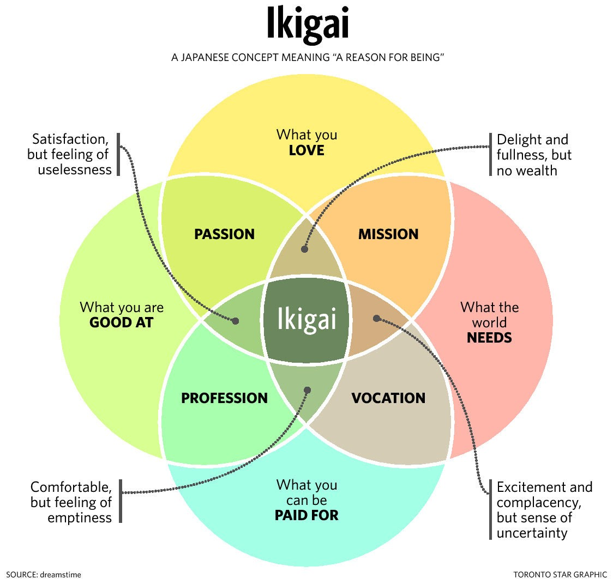

The Okinawan Way of Life has 5 aspects to it. Warm people, Blissful work, light diet & movement, stoic attitude. 

## Moai - Community
- Surround yourself with great friends, friends are the best medicine, there for confiding worries over a good chat, sharing stories that brighten your day, getting advice, having fun!! Living!
- Be a part of a community that looks out for each other. Provide and feel financially and emotionally secure . This gives you a sense of **security** and helps increase life expectancy.

## Ikigai
Do things you **love** and have **mastered** (satisfying & certain), which the world **needs** and **pays** for (useful and wealthy).

- Flow - Get completely immersed in the experience. Not thinking about or distracted by anything else. Your ego dissolves, and you become part of what you are doing.
- Experience is so enjoyable that you will do it even at great cost, for the sheer sake of doing it.
- What makes you enjoy doing something so much that you forget about time and worries fade way. What will you pay to do it.
- Discover your ikigai by doing many things. Not by thinking
- When you set out to create something. You are using nature to infuse life into it. Create beauty!

## Diet

Nutrition/Calorie ratio should be super high
- Rarely eat sugar
- Eat less than 10g of salt / day
- Hara hachi bu , eat only till you are 80% full. over eating will wear down the body with long digestive process and accelerate cellular oxidation.
- Try to fast once a week?
- Drink 3 cups [Sanpin cha](https://yunomi.life/products/nakazen-jasmine-tea-sanpin-cha) jasmine tea
- Antioxidants like salmon, citrus & dried fruits, oats.

## Movement
- Gentle excercise. Connect with the mind, body and soul. Connect with your inner energy. Doing this as a group promotes one ness
- Surya namaskar 

## Attitude
- You can enjoy the pleasures of life as long as they dont control you.
(Seneca put things into practice by not having servants for a week & advices to practice negative visualization before going to sleep)
- The way you face difficult situtions make a big difference to our quality of life.Face them with resilience , which means focus on what is important, accept all emotions, and do actions which create new emotions
> **Accept all emotions, create new emotion via action**

