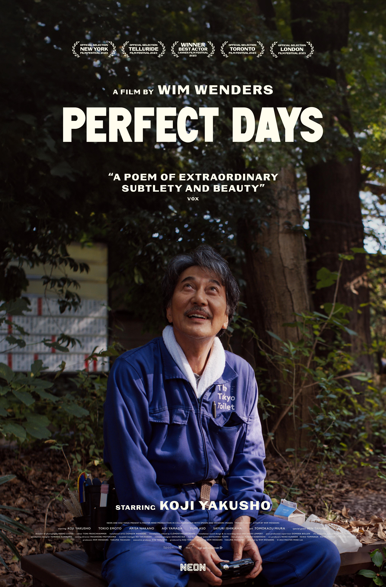

I watched *Perfect Days* yesterday. As someone who often sleeps through commercial films---and, frankly, most movies---I was stunned to find myself fully awake at 11 PM, an hour into this quiet, repetitive masterpiece. No explosions, no villains, no grand heroics---just a man cleaning toilets in Tokyo. Yet, here I was, utterly captivated. If that isn't cinematic sorcery, what is?

### The Frame That Holds the Soul
The film's aspect ratio felt almost IMAX-like---not the wide-angle sprawl, but a taller, more intimate canvas. Portrait shots? Maybe. But I suspect it was Tokyo itself: the unspoken respect in every gesture, the streets humming with quiet dignity. The cinematography wasn't just a backdrop; it was a love letter to a city that breathes through its rituals.

### Beauty Without a Why
For 30 minutes, our protagonist cleans toilets. Repetitive? Yes. Hypnotic? Absolutely. There's something achingly beautiful in his equanimity. He gives a good portion of his savings to a coworker, photographs sunlight filtering through trees (*komorebi*, I've learned), and savors the hum of cassette tapes. No grand ambitions---just presence. ChatGPT later told me this film isn't about plot. Of course it isn't. Plots are cages. Life isn't "good vs. evil"; it's finding grace in the invisible corners of existence.

### The Alchemy of Routine
His days are a meditation:

-   Wake. Brush. Uniform. *Go*.
-   Vending-machine coffee. Cassette melodies. Tokyo Tower glimpsed between alleyways.
-   Toilets cleaned with monastic precision---even the hidden parts.
-   Lawson's sandwich under dappled sunlight. Evening bike rides. Sento baths.
-   Sleep. Dream. Repeat.

No goals. No angst. Just motion and stillness intertwined. It reminded me of *Jiro's Dreams of Sushi*---craft as prayer, routine as rebellion against chaos. Years ago, a friend told me, "If you want calm, build a routine." I scoffed then. Now I see: ritual isn't rigidity; it's freedom.

### When Life Intrudes (Gently)
People drift into his orbit: a niece's spontaneous affection, a coworker's tentative crush. For a moment, he's shaken---laughing, crying, nursing a beer. Yet he remains a quiet pillar, drawing others in not through charisma, but through the quiet magnetism of a life fully lived. Lesson? *People adore those who adore life.

### Why This Movie? Why Me?
Tokyo's allure? The komorebi philosophy? Or the radical notion that beauty needs no meaning? Maybe it's simpler: *Perfect Days* mirrors a truth we've buried under productivity hacks and rocket launches. Joy isn't earned; it's noticed. The film's "black strips" on the screen? By the end, they felt like borders framing a poem---an invitation to focus on what's already there. 

### Final Thought
I'll leave you with this: After the credits rolled, I woke up today still tasting the film's quiet joy. Not because it taught me anything, but because it *untaught* me. Strip away the noise, and what remains? Sunlight. Trees. A sandwich. A scrubbed toilet. A life not chasing, but *being*.

Maybe that's the komorebi we're all missing. *P.S. To the filmmakers: Thank you for the vertical black strips. My TV has never felt so full.* ✨ *(Inspired by Wim Wenders'* Perfect Days*---and the small, stubborn magic of noticing.)*